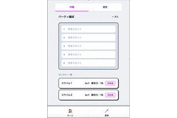
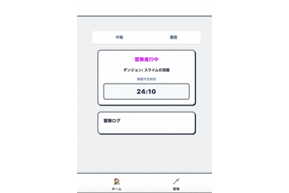
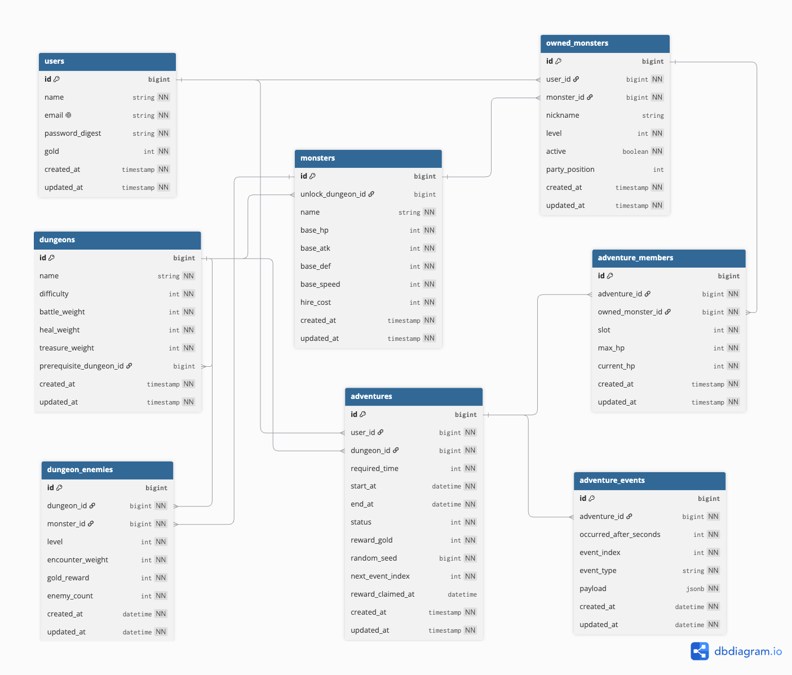

# ポモクエ
## 公開URL
https://pomodoro-quest-eventlog.onrender.com

## サービス概要
**「モンスターを育成して未知のダンジョンを攻略する、WebブラウザRPG」**

プレイヤーはモンスターを雇い、パーティを編成してダンジョンへ派遣します。  
時間の経過とともに冒険が進行し、帰還後にゴールドを獲得してさらに強力なパーティを育成していく放置型育成ゲームです。

---

## なぜ作ったのか（開発背景）
ポモドーロタイマーを用いて学習していた際、冒険時間「25分」のゲームを作れば、タイマーとしても機能する放置ゲームを実現できるのではないかと考えたことが開発のきっかけです。

---

## 序盤の攻略フロー
1. スライムを1体雇う
2. 100G 貯まるまで冒険（全滅含む）を繰り返す
3. 100G でスライムのレベルを 2 に上げる

➔ ここまで進めると、安定してダンジョンを踏破できるようになります。

### UX上の課題と今後の改善予定
#### 【現状の課題】
現状の仕様では、全滅時に即時帰還してしまうため、「25分間集中する」というポモドーロタイマーとしての機能が途中で途切れてしまう課題があります。

#### 【改善アプローチ（クエスト機能の実装）】

ゲームの勝敗に関わらず、タイマーとしての集中時間を担保できるよう以下の仕様改修を予定しています。

- **タイマー完走の強制**:
  
    全滅時であっても即時帰還させず、指定時間の経過を要求する

- **ポモカウンターの導入**:

  勝敗を問わず、時間を完走することで「ポモカウンター」が付与される

- **報酬システムの拡張**:

  獲得したポモカウンターを消費して受け取れる「クエスト機能」を実装し、全滅時でもゲーム上のリターンが得られるようにする

---

## 主な機能

### ユーザー機能
* **認証機能**: ユーザー登録・ログイン・ログアウト（Devise）
* **ダッシュボード**: 所有モンスター、進行中の冒険一覧表示

### モンスター・パーティ管理
* **モンスター雇用**: ゴールドを消費して新しいモンスターを獲得
* **パーティ編成**: 最大5体の所有モンスターをパーティに組み込み・外し

### ダンジョン冒険
* **ダンジョン選択**: 前提ダンジョンのクリア状況に応じた解放判定
* **冒険出発・進行**: 派遣時間（所要時間）を設定して冒険を開始
* **進行中のタイマー表示**: Stimulusを用いたカウントダウン
* **イベントのリアルタイム更新**: 5秒ポーリングでイベントを取得
* **結果確認・報酬受取**: 冒険完了後の勝敗判定、ゴールド報酬の獲得

### 特に見てほしいポイント
#### SPAのようなパーティ編成機能
- Turbo Stream を活用し、メンバーの追加・入れ替え時に画面の必要なパーツのみを非同期（Ajax）で更新しています。

#### Hotwire による「イベントのリアルタイムログ更新」
- Stimulus を用いて 5 秒周期でサーバーへイベントの有無をポーリング（確認）し、新しいイベントを検知した際に Turbo Stream でリアルタイムに描画しています。

---

## 使用技術

| カテゴリ | 技術スタック |
| --- | --- |
| **バックエンド** | Ruby [4.0.6] / Ruby on Rails [8.1.3.1] |
| **フロントエンド** | HTML5 / CSS3 / Tailwind CSS / Turbo / Stimulus |
| **データベース** | PostgreSQL [17] |
| **テスト** | RSpec / FactoryBot / Capybara / RuboCop |
| **インフラ / 配信** | Render / Neon / Docker |

---

## 今後の改善ポイント

- **クエストボードの作成**
- アイテムの実装
- 戦闘システムの拡張
- ダンジョン詳細

## デプロイ

- Renderで公開

## 画面遷移図

## ER図

